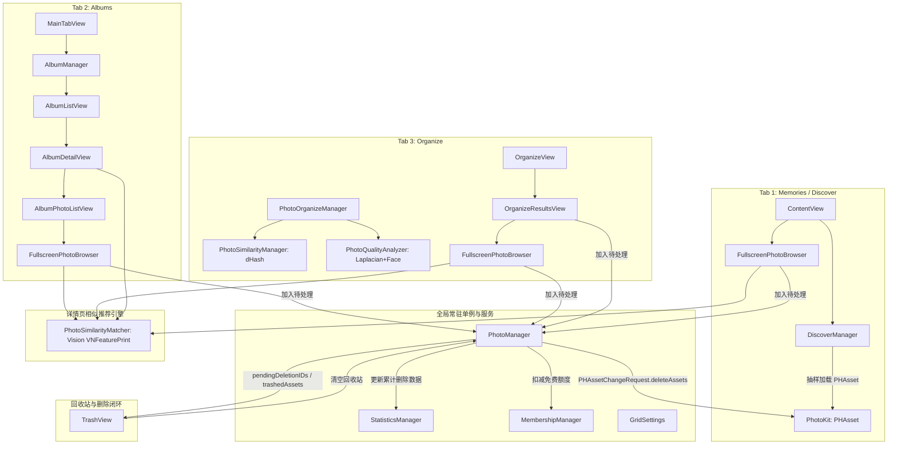

# CleanMyPhoto (Photato) 项目总览与架构上下文

> 本文档由代码深度静态分析自动汇总生成，全面记录了项目的目录架构、核心数据流、模块依赖、关键业务流程以及现有隐患与技术债清单。

---

## 1. 项目概述与定位

- **产品名称**：Photato (Xcode 内部 Scheme 与历史代码名为 CleanMyPhoto)
- **平台与技术栈**：iOS (最低支持 iOS 18.0，向下兼容至 iOS 17 部分特性，适配 iOS 26+ Liquid Glass/SF Symbols 7)
- **开发语言与架构**：Swift 5.10 / Swift 6 兼容模式，SwiftUI 原生构建，混合采用 MVVM 架构（Combine `ObservableObject` 与 Swift 5.9+ `@Observable` 并存）
- **核心功能定位**：本地图库智能清理与相册管理工具。包括照片流随机回顾（Memories/Discover）、相册浏览与 AI 相似照片智能聚合推荐、深度清理（相似照片、重复照片、大文件、低质量、模糊照片、闭眼表情差照片、屏幕截图等分类分析与批量软删除）、StoreKit 2 订阅/买断内购体系。

---

## 2. 目录结构与模块划分

```
Photato/
├── Photato.xcodeproj                # Xcode 工程配置（单 Target: Photato）
├── Photato.storekit                 # 本地 StoreKit 测试配置文件
├── Resources/
│   ├── CleanMyPhotoApp.swift        # App 主入口 (@main)
│   ├── Localizable.xcstrings        # 多语言本地化字典（支持中/英等）
│   └── InfoPlist.xcstrings          # 权限描述等 Info.plist 本地化
├── Models/                          # 数据模型层
│   ├── PhotoAsset.swift             # 核心照片资产模型（封装 PHAsset，含媒体类型检测）
│   ├── AlbumModel.swift             # 相册模型（封装 PHAssetCollection，封面与 3 张堆叠缩略图）
│   ├── OrganizeResult.swift         # 整理扫描分组模型与 JSON 缓存结构体
│   ├── MembershipStatus.swift       # 会员状态持久化模型 (UserDefaults)
│   ├── SubscriptionProduct.swift    # StoreKit 2 商品标识与订阅类型枚举
│   ├── MediaFormatFilter.swift      # 格式筛选器枚举（全部/视频/实况/截屏/GIF）
│   ├── SystemAlbumCollection.swift  # [遗留死代码] 年份相册模型 YearAlbum / MonthAlbum
│   ├── PhotoGroup.swift             # [遗留死代码] 年月日三级分组模型 YearGroup
│   ├── PhotoSection.swift           # [遗留死代码] 初始月份分组模型
│   └── Untitled                     # [残留废文件] 误存入的编译器错误信息文本
├── ViewModels/                      # 视图模型层
│   ├── PhotoManager.swift           # 照片库权限、软删除回收站、永久删除、系统相册变更监听
│   ├── MembershipManager.swift      # StoreKit 2 交易监听、购买、恢复、权益刷新与免费删除额度
│   ├── StatisticsManager.swift      # 累计已删除张数、释放体积、本地缓存计数
│   ├── SelectionManager.swift       # 页面内通用多选状态管理器 (@Observable)
│   ├── PhotoOrganizeManager.swift   # 整理模块总协调器 (@Observable, 快速分析/全量扫描/分页加载)
│   ├── PhotoSimilarityManager.swift # 整理页 dHash 指纹计算与贪心聚类 (基于 Core Data)
│   ├── PhotoQualityAnalyzer.swift   # 整理页清晰度与人脸质量分析器 (Laplacian方差 + Vision)
│   ├── AlbumManager.swift           # 用户相册列表、相册内照片读取、相册照片添加/移除与推荐缓存
│   ├── SystemAlbumManager.swift     # [遗留死代码] 年份相册管理器（全库资产遍历，未被引用）
│   └── PhotoGroupManager.swift      # [遗留死代码] 日期多级分组管理器（未被引用）
├── Utils/                           # 工具库与后台引擎
│   ├── PhotoSimilarityMatcher.swift # 详情页/相册推荐专用 Vision 向量特征匹配引擎 (含独立 Core Data)
│   ├── PHAssetSizeHelper.swift      # 照片文件大小提取（KVC私有属性 + 数据流回退 + NSCache）
│   ├── AlbumCoverCache.swift        # 相册封面内存字典缓存
│   ├── PhotoCaptionResolver.swift   # CLGeocoder 拍摄地点反查与时间格式化（单例内存缓存）
│   ├── RecentAlbumsStore.swift      # 最近操作相簿持久化记录 (UserDefaults)
│   ├── GridColumnHelper.swift       # 网格列数计算与缩略图物理像素标准规范
│   ├── ScreenSizeHelper.swift       # 屏幕尺寸工具
│   ├── ScrollOffsetPreferenceKey.swift # 滚动偏移 PreferenceKey
│   ├── ShimmerModifier.swift        # 骨架屏扫光动效
│   └── SizeCache.swift              # 分类与相册体积持久化缓存 (UserDefaults)
├── Extensions/
│   └── PHAsset+Image.swift          # 超大扩展文件 (1037行)：内存图片缓存、PHCachingImageManager封装、
│                                    # AssetImage 视图、AVPlayer 封装、VideoPlayerState 视图模型、
│                                    # 视频控件条/进度条、LivePhoto 播放视图
└── Views/                           # 视图展示层
    ├── MainTabView.swift            # 底部 4 Tab 主框架（Memories / Albums / Organize / Settings）
    ├── ContentView.swift            # Memories 容器视图（权限拦截 + DiscoverView 包装）
    ├── DiscoverView.swift           # Memories 主页：惰性 Fisher-Yates 随机抽样照片流与下拉刷新
    │                                # [架构错位] 内部声明了 DiscoverManager 视图模型
    ├── TrashView.swift              # 待处理照片（回收站）浮层：单张/批量恢复、清空物理删除、付费墙门禁
    ├── MembershipView.swift         # 会员付费墙页面（支持半屏/全屏，多档位购买与试用说明）
    ├── SettingsView.swift           # 设置页：会员卡片、清理统计、网格列数与照片比例设置
    ├── AlbumListView.swift          # 相册列表视图
    ├── AlbumDetailView.swift        # 相册详情页（封面、最新 3 张堆叠、AI 相似照片瀑布流推荐）
    ├── AlbumPhotoListView.swift     # 相册全部照片网格视图（支持瀑布流/固定网格切换）
    ├── DraggablePhotoView.swift     # 核心照片浏览卡片 (1782行)：捏合缩放、双击缩放、上滑删除、
    │                                # 下滑关闭、左右切图、视频播放手势融合
    ├── PhotoListView.swift          # [遗留死代码] 早期按月排列的相册照片流网格（已被 DiscoverView 取代）
    ├── OrbitingAvatarView.swift     # [遗留死代码] 环绕动画头像视图 (446行，未被引用)
    ├── Organize/
    │   ├── OrganizeView.swift       # 整理分类仪表盘（功能分类卡片 + 媒体类型卡片 + 扫描触发）
    │   └── OrganizeResultsView.swift# 整理结果列表 (1007行)：相似/重复分组展示与平铺展示，AI 帮选
    ├── Navigation/
    │   └── NavigationDestinations.swift # 导航路由枚举 (AlbumsDestination / TimelineDestination)
    └── Components/                  # 可复用组件
        ├── PhotoCell.swift          # 照片网格单元格（含扫光骨架屏、媒体类型角标、选中态）
        ├── FullscreenPhotoBrowser.swift # 共享全屏大图浏览器 (1137行，胶卷缩略图条、地点标题、相似图推荐)
        ├── MasonryGridView.swift    # 原比例瀑布流布局组件 (MasonryGridContent)
        ├── PhotoFilmStrip.swift     # 大图下方胶卷缩略图滑动选择条
        ├── AddToAlbumSheet.swift    # 添加到相簿面板（含新建相簿与已添加判断）
        ├── AlbumScanProgressSheet.swift # 相簿 AI 相似扫描半屏进度弹窗
        ├── AlbumStackCell.swift     # 相册列表 3 层堆叠封面卡片
        ├── PhotoInfoSheet.swift     # 照片 EXIF 元数据半屏面板
        ├── PendingPhotosEntryButton.swift # 导航栏待处理照片右上角入口按钮（带数字徽标）
        ├── ZoomInteractiveDismissConfigurator.swift # iOS 18 Zoom 转场与手势黑魔法拦截器
        ├── TopBlurFadeBackground.swift # 顶部渐变模糊毛玻璃底板
        ├── ProductCard.swift        # 会员商品选项卡组件
        ├── PrimaryButtonStyle.swift # 渐变主按钮样式
        ├── ShareSheetPresenter.swift# UIActivityViewController 分享封装
        ├── AppGradients.swift       # 全局色彩渐变定义
        └── DateSection.swift        # [遗留死代码] DateSectionView 组件（未被引用）
```

---

## 3. 核心数据流架构（ViewModel / 状态管理）

### 3.1 状态管理分化现况
项目当前处于 **Combine `ObservableObject`** 与 **iOS 17 `Observation` (`@Observable`)** 的混合过渡状态：
- **`ObservableObject` 阵营**：`PhotoManager`, `MembershipManager`, `StatisticsManager`, `AlbumManager`, `DiscoverManager`, `SystemAlbumManager`, `PhotoGroupManager`, `AlbumCoverCache`, `VideoPlayerState`
- **`@Observable` 阵营**：`PhotoOrganizeManager`, `PhotoSimilarityManager`, `PhotoQualityAnalyzer`, `SelectionManager`, `GridSettings`

### 3.2 根节点依赖注入 (`CleanMyPhotoApp`)
```
CleanMyPhotoApp (App Entry)
 ├── @StateObject statisticsManager: StatisticsManager
 ├── @StateObject membershipManager: MembershipManager
 ├── @StateObject photoManager: PhotoManager (依赖注入 statisticsManager, weak 引用 membershipManager)
 └── @State gridSettings: GridSettings (@Observable)
```
注入方式：
- `photoManager`, `membershipManager`, `statisticsManager` 通过 `.environmentObject(...)` 注入整个视图树。
- `gridSettings` 通过 `.environment(gridSettings)` 注入。

### 3.3 核心数据流转拓扑



---

## 4. 模块间依赖关系与调用拓扑

### 4.1 核心管理者依赖细节
1. **`PhotoManager` 与 `MembershipManager` / `StatisticsManager`**：
   - `PhotoManager` 初始化时注入 `StatisticsManager`（强引用）；
   - `PhotoManager.membershipManager` 为 `weak var`（弱引用），彻底规避了 App 顶层的强引用循环；
   - 触发时机：`emptyTrash()` 成功物理删除后，调用 `statisticsManager?.recordDeletions(count, totalSize)` 且调用 `membershipManager?.consumeFreeDeletions(count)`。
2. **`AlbumManager` 与 `PhotoManager`**：
   - `AlbumManager` 强引用持有 `PhotoManager`，用于计算 `displayedAlbumPhotos`（排除 `pendingDeletionIDs`）；
   - `PhotoManager` 不反向引用 `AlbumManager`，无循环引用。
3. **`PhotoOrganizeManager` 与子分析器**：
   - `PhotoOrganizeManager` 直接实例化并持有 `PhotoSimilarityManager` 和 `PhotoQualityAnalyzer`；
   - 子分析器纯粹提供计算和缓存，不反向引用上层 Manager。
4. **两套完全平行的相似图计算系统**：
   - **整理页**：`PhotoSimilarityManager`（9x8 缩略图、dHash 差异哈希、64 位 UInt64 汉明距离聚类，持久化在 `PhotoSimilarity.sqlite`）；
   - **大图详情页与相册推荐**：`PhotoSimilarityMatcher`（Vision `VNGenerateImageFeaturePrintRequest` 深度学习特征向量、浮点余弦/欧氏距离匹配，持久化在 `PhotoSimilarityMatcherCache.sqlite`，单例持有 2000 条内存缓存）。

---

## 5. 关键业务流程详述

### 5.1 图库加载流程
- **回忆页 (DiscoverView)**：
  1. 用户启动进入主 Tab 1，`DiscoverManager` 调用 `refresh()`；
  2. 后台线程执行 `PHAsset.fetchAssets(with: options)`（带所选格式谓词过滤，如视频/实况等）；
  3. 构建 `pool = Array(0..<count)` 惰性索引池，使用 Fisher-Yates 算法按批次（默认 60 张）抽样交换；
  4. 保证单批次耗时在毫秒级、跨批次不重复，滚动到底部懒追加，避免将数万张照片实体一次性加载进内存；
  5. 切换筛选格式时，利用 `filterSnapshots` 缓存当前分类抽样池状态，回切时免重复请求。
- **相册页 (AlbumListView / AlbumDetailView)**：
  1. `AlbumManager.fetchUserAlbums()` 获取常规用户相册（排除智能相册），读取封面与末尾最多 3 张照片作为叠放卡片；
  2. 点进详情页，异步加载相簿前排照片；后台静默启动 `PhotoSimilarityMatcher.shared` 检索可能属于该相簿的图库相似照片作为推荐流。

### 5.2 照片处理与清理扫描流程
- **轻量扫描 (`quickAnalysis`)**：
  1. 优先读取磁盘 JSON 快照 `OrganizeCache.json`（版本 9），若版本一致且存在直接秒级载入各类统计与 ID 集合；
  2. 若无 JSON 缓存，从 Core Data 恢复已有数据，并在后台完成元数据分类（截屏/实况/视频，单次循环三合一）。
- **全量深度扫描 (`startFullAnalysis`)**：
  - **Step 1 (元数据)**：单次遍历枚举 `mediaSubtypes` 提取截屏、实况和视频；
  - **Step 2 (大文件)**：多核并发通过 `PHAssetResource` 批量提取真实文件体积（优先读 Core Data 缓存，缺失则查系统）；筛选 >=10MB 或 (>=24MP 且 >=6MB) 的素材；
  - **Step 3 (低质量)**：分辨率 < 1080p 且体积 <= 50KB 的低清缩略图碎片；
  - **Step 4 (相似/重复)**：`PhotoSimilarityManager` 批量计算 dHash 指纹写入 Core Data；基于拍摄时间倒序、宽高比偏差 < 0.15、分辨率比率 < 1.5、分级汉明距离阈值（抓拍<=6, 连拍<=5, 构图<=3）和整簇最大距离 <= 6 实施贪心聚类；
  - **Step 5 (模糊与人脸)**：`PhotoQualityAnalyzer` 在后台多核派发，提取 256px 灰度缩略图做拉普拉斯卷积核求方差（方差 < 80.0 判定模糊）；调用 Vision `VNDetectFaceCaptureQualityRequest`（最低人脸质量 < 0.3 判定闭眼/表情差）；
  - **Step 6 (落地快照)**：结果写入 `OrganizeCache.json`，供下次启动秒开。

### 5.3 订阅内购与付费墙流程 (StoreKit 2)
1. **启动与初始化**：
   - `MembershipManager.init()` 从 `UserDefaults` 恢复历史会员级别和免费删除额度；
   - 挂载 `listenForTransactions()` 监听后台交易流（`StoreKit.Transaction.updates`）。
2. **商品与权益加载**：
   - 优化为按需加载（进入付费墙时触发 `ensureProductsLoaded`），冷缓存配置自动重试机制（1s / 3s）；
   - 通过 `monthlySubscription.isEligibleForIntroOffer` 精准校验当前 Apple ID 是否还能享受免费试用，避免文案与实际扣费冲突；
   - 监听与权益刷新使用 `StoreKit.Transaction.currentEntitlements`，订阅到期、退款自动降级为 `.free`。
3. **功能门禁（免费额度 vs 专业版）**：
   - **免费用户**：享有一次性 100 张永久删除额度（`freeDeletionQuota = 100`）；
   - **软删除门禁**：上滑/多选移入待处理（回收站）全程免费无门槛；
   - **物理删除门禁**：点击“清空回收站”时，若为会员或仍有剩余免费额度，放行删除；若非会员且额度耗尽，弹出 `MembershipView(isMandatory: true)` 拦截。

### 5.4 Widget (小组件) 现况
- **代码库现状**：经全局检索与 Xcode 工程文件分析，**当前项目未集成 WidgetKit 扩展 Target**，没有任何 `.swift` 文件包含 `Widget` 或 `WidgetBundle`。
- **架构准备度**：数据层中的 `StatisticsManager`（已释放空间、已删除数）与 `OrganizeCache.json`（可清理数）数据均存储于本地独立沙盒，若后续扩展 Widget，需开启 App Group 将 `UserDefaults` 与缓存目录迁移至共享容器。

---

## 6. 隐患清单：内存、性能、架构与技术债

### 6.1 内存与缓存管理隐患 (高优先级)
1. **三套完全独立的 Core Data 持久化栈**：
   - `PhotoSimilarity.sqlite` (由 `PhotoSimilarityManager` 管理，存 dHash 指纹)；
   - `PhotoQuality.sqlite` (由 `PhotoQualityAnalyzer` 管理，存模糊度与人脸分)；
   - `PhotoSimilarityMatcherCache.sqlite` (由 `PhotoSimilarityMatcher` 管理，存 Vision 特征)；
   - **风险**：各自维护独立的 `NSPersistentContainer` 与上下文，重复占用文件句柄、内存映射与 SQLite 连接池，架构割裂。
2. **无限增长的非受控内存字典缓存**：
   - `AlbumCoverCache.shared.cache: [String: UIImage]` 为普通 Swift 字典，无数量上限、无内存成本限制，未监听 `didReceiveMemoryWarningNotification`；
   - `PhotoCaptionResolver.shared.addressCache: [String: (place: String?, full: String?)]` 同样为无界字典，用户浏览上千张照片后常驻内存无法释放。
3. **`SystemAlbumManager` 的全库内存加载 (严重潜在 OOM)**：
   - `SystemAlbumManager.fetchYearAlbums()` 在主线程枚举整个用户相册 (`allAssets.enumerateObjects`)，并将所有 `PHAsset` 分组存入 `[Int: [PHAsset]]`。若用户相册有 5~10 万张照片，将直接物化数万个对象导致主线程卡死甚至 OOM 闪退。（注：该类目前未被视图调用，属于休眠隐患）。

### 6.2 SwiftUI 渲染与性能隐患 (中/高优先级)
1. **网格单元格内滥用 `GeometryReader`**：
   - `PhotoCell.swift` 的外层直接嵌套了 `GeometryReader`，在 `AdaptivePhotoGrid` / `LazyVGrid` 快速滚动时，每一帧每个屏幕内的 Cell 都会触发 Geometry 测量，导致快速划动时帧率抖动。
2. **`OrganizeResultsView` 频繁全量重建分节 (`rebuildDateSections`)**：
   - 该视图代码达 1007 行，`rebuildDateSections()` 负责将数百个分组重新映射为 `DateSection` 数组；
   - 在 `onAppear`, `task`, `onChange(of: displayedPhotos.count)`, `onChange(of: displayedGroups.count)`, `onChange(of: photoManager.pendingDeletionIDs)` 以及滚动分批加载时均频繁触发，易引发列表多余的重排与闪烁。
3. **回收站批量恢复的 N 次级联重绘**：
   - `TrashView.swift` 批量恢复所选照片时：
     ```swift
     for id in selectionManager.selectedIDs {
         photoManager.restoreFromTrash(id)
     }
     ```
     每次 `restoreFromTrash(id)` 内部都直接操作 `@Published` 并调用 `updateDisplayedPhotos()`。若多选 100 张恢复，将连续派发 100 次全局响应式变更通知。
4. **废弃组件与状态传递冗余**：
   - `TrashView` 仍在根部使用 iOS 16 弃用的 `NavigationView`；
   - `MainTabView` 在向 `SettingsView` 传递 `organizeManager` 时，既通过参数传入 `SettingsView(organizeManager: ...)`，又通过环境 `.environment(organizeManager)` 传入，在 `SettingsView` 内部出现 `activeOrganizeManager` 双保险计算，状态归属权模糊。

### 6.3 架构设计与代码重复隐患
1. **相似图片两套轮子并存**：
   - 整理页一套 (dHash 算法 + 汉明距离聚类)；
   - 详情页与相册推荐一套 (Vision ML 特征指纹 + 欧氏距离)；
   - 两套引擎无论从概念、数据库、缓存还是计算队列上均完全割裂，未能统一为底层视觉识别服务层。
2. **ViewModel 位置与职责错位**：
   - `DiscoverManager`（发现页核心 ViewModel，200 余行逻辑）未放在 `ViewModels/` 目录，而是定义在 `Views/DiscoverView.swift` 文件头部；
   - `VideoPlayerState`（视频播放状态机）被放置在 `Extensions/PHAsset+Image.swift` 文件中；
   - `DateSection` 在 `Views/Components/DateSection.swift` 中定义了一套视图组件（完全未用），在 `OrganizeResultsView.swift` 内部又自建了另一套 `private struct DateSection`。
3. **单文件膨胀与上帝视图**：
   - `DraggablePhotoView.swift`：1,782 行，糅合了全屏沉浸手势、双击/捏合矩阵计算、视频播放器生命周期、删除动画状态机；
   - `FullscreenPhotoBrowser.swift`：1,137 行；
   - `PHAsset+Image.swift`：1,037 行（混合缓存、下载器、UI 组件、视频状态、音频会话）；
   - `OrganizeResultsView.swift`：1,007 行。

### 6.4 苹果审核与私有 API 探测风险
1. **通过 KVC 读取 `PHAssetResource` 私有属性**：
   - `PHAssetSizeHelper.swift` 第 55 行：
     ```swift
     (resource.value(forKey: "fileSize") as? Int64)
     ```
     `PHAssetResource` 并没有公开的 `fileSize` 属性。此用法虽在清理类工具中常见，但本质属于私有 KVC 访问，在未来 iOS SDK 演进时存在静默失效或 App Store 审核被拒风险。
2. **UIKit 私有类名手势探测与 KVC 侵入**：
   - `ZoomInteractiveDismissConfigurator.swift` 中：
     ```swift
     let options = (transition as AnyObject).value(forKey: "options")
     // 字符串匹配私有类名:
     className.contains("Transform")   // _UITransformGestureRecognizer
     className.contains("SwipeDown")   // _UISwipeDownGestureRecognizer
     ```
     通过运行时 KVC 获取 `preferredTransition` 的内部 `options` 并按私有类名启停手势。一旦 iOS 升级变更内部类名，转场拦截将出现未定义行为。

### 6.5 遗留僵尸代码与垃圾文件清单
以下文件在当前活跃业务中**完全没有被调用或实例化**，属于历史重构遗留：

| 文件路径 | 属性 | 现状说明 |
| :--- | :--- | :--- |
| `Photato/Models/Untitled` | 垃圾文件 | 误存入的 2 行 Xcode 编译错误日志文本，应立即删除 |
| `Photato/Views/PhotoListView.swift` | 僵尸视图 (336行) | 早期相册列表网格，主入口已改由 `DiscoverView` 接管，全工程无有效引用 |
| `Photato/ViewModels/PhotoGroupManager.swift` | 僵尸逻辑 (104行) | 年月日分组管理器，未被任何激活视图引用 |
| `Photato/Models/PhotoGroup.swift` | 僵尸模型 | 配套 `PhotoGroupManager` 的模型定义 |
| `Photato/ViewModels/SystemAlbumManager.swift` | 僵尸逻辑 (323行) | 年份/月份相册管理器，存在主线程全库遍历隐患，未被引用 |
| `Photato/Models/SystemAlbumCollection.swift` | 僵尸模型 | 配套 `SystemAlbumManager` 的模型定义 |
| `Photato/Models/PhotoSection.swift` | 僵尸模型 | 早期月份分组模型，全工程无有效引用 |
| `Photato/Views/OrbitingAvatarView.swift` | 僵尸视图 (446行) | 环绕头像视图，全工程无有效引用 |
| `Photato/Views/Components/DateSection.swift` | 僵尸组件 | `DateSectionView` 组件未被任何地方使用 |
| `PhotoManager.fetchAllPhotos()` 及分页变量 | 僵尸逻辑 | `allPhotos` / `displayedPhotos` 除死代码 `PhotoListView` 外仅在内部空转 |

---

## 7. 架构演进与重构路线建议

1. **第一阶段：轻量化清理 (Quick Wins)**
   - 删除 `Models/Untitled`、`PhotoListView.swift`、`OrbitingAvatarView.swift`、`SystemAlbumManager.swift`、`PhotoGroupManager.swift` 及相关死代码模型；
   - 将 `DiscoverManager` 移动至 `ViewModels/` 目录；
   - 修复 `TrashView.swift` 中的批量恢复，在 `PhotoManager` 增加 `restoreFromTrash(_ ids: [String])` 单次批量赋值接口；
   - 将 `TrashView.swift` 的 `NavigationView` 升级为 `NavigationStack`。
2. **第二阶段：内存与安全性治理 (Memory & Stability)**
   - 将 `AlbumCoverCache` 与 `PhotoCaptionResolver` 的原生字典重构为具备大小上限和淘汰机制的 `NSCache`，并监听系统内存警告通知；
   - 将 `PHAssetSizeHelper` 中的私有 KVC `fileSize` 访问封装充分的容错并探索公开 API 替代（如 `PHAssetResourceManager` 的尺寸检查或头信息解析）。
3. **第三阶段：相似算法统一与 Core Data 收敛 (Architecture Alignment)**
   - 评估将整理页的 dHash 算法与详情页的 Vision `VNFeaturePrint` 统一到单一的视觉服务抽象层中，合并 3 个独立的 SQLite 数据库为统一的本地元数据存储模型；
   - 全面迁移所有 ViewModel 至 Swift `@Observable` 宏，统一状态消费机制，消除 Combine 与 Observation 混用的心智负担。
